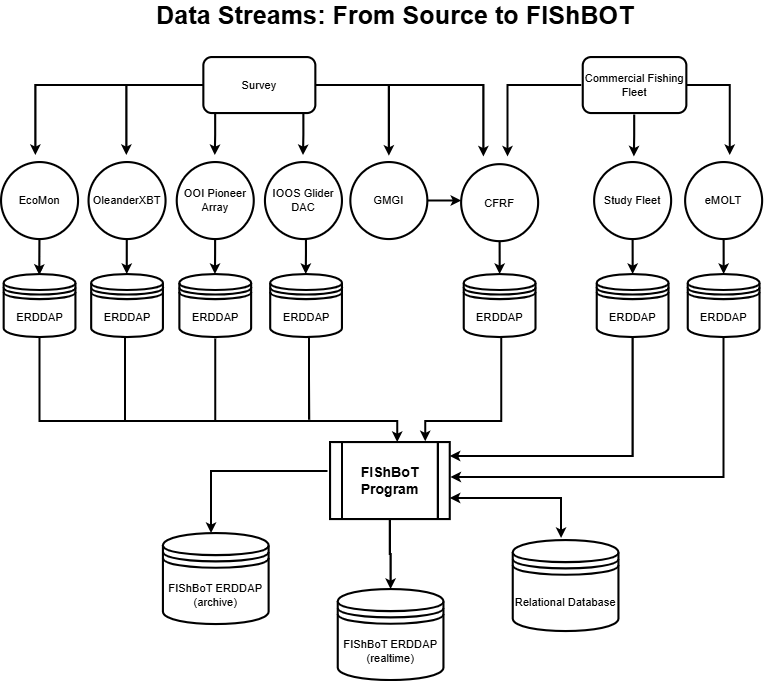

### FIShBOT Workflow:

The following schematic details the flow of data streams 
into the FIShBOT data product. Our near-real time data product pulls together
both fishery-dependent (Commercial Fishing Fleet) and fishery-independent 
(Survey) oceanographic data and feeds it through our FIShBOT Program, which then 
turns it into one product (FIShBOT), a map of daily temperature 
averages across a 7km grid covering the Northwest Atlantic. This 
interorganizational effort relies on data being made publicly available
through web-based scientific data servers (ERDDAP). 

### Refresh Interval
FIShBOT is updated dynamically every 24 hours. The dynamic refresh
interval balances making real-time data accessible quickly and optimizing 
storage and performance. The contributing groups to FIShBOT rely on a
rolling QA/QC schedule and often receive data at intermittent intervals 
from the fleet. To capture the dynamic nature of data contributing to FIShBOT, 
the program itself must be dynamic to reflect perpetual QA/QC efforts.

# FIShBOT Program

FIShBOT is both a dataset and a Python program designed to 
synchronize and archive data from various sources to a standardized grid. The 
programatic side of this project has been designed to collect and combine data
from each data server (ERDDAP above) and produces both a near-real-time data 
product and a companion fixed-version data product, which serves as an archive
that captures each release of data. The source code lives in a public repository here: 

[GitHub Repo](https://github.com/CommercialFisheriesResearchFoundation/fishbot.git){.btn .btn-primary role="button" style="background-color: #32926F; color: white; border-color: #32926F;"}

# FIShBOT documentation

### FIShBOT Archive Citation
Each FIShBOT archive is minted a DOI for versioned citation. This is helpful
if the data are incorporated into specific analysis or assessment for
reproducibility. This is done automatically through the Zenodo API. The record 
of citations is collated in the FIShBOT Community on Zenodo.

[FIShBOT Archive](https://zenodo.org/communities/fishbot/records?q=&l=list&p=1&s=10&sort=newest){.btn .btn-primary role="button" style="background-color: #32926F; color: white; border-color: #32926F;"}

### Technical Memorandum
The full details of the system design, data flow, and methodology for this
gridded data product are documented via a Technical Memorandum hosted by the
Northeast Fisheries Science Center. This documentation is accessible to the 
public and can be downloaded as a PDF. Click the button below to access that
Memorandum and learn more! 

[FIShBOT Technical Memorandum](https://repository.library.noaa.gov/view/noaa/72384){.btn .btn-primary role="button" style="background-color: #32926F; color: white; border-color: #32926F;"}

### Data Contributors

- Study Fleet (NEFSC-NOAA)
- eMOLT (GOMLF, NOAA, CCS, UMaine, CFRF, CFF, ODN, Rutgers)
- ECOMON (NEFSC-NOAA)
- Lobster & Jonah Crab Research Fleet (CFRF)
- Oleander XBT (BIOS)
- Pioneer Array (OOI)
- Gloucester Marine Genomics Institute (GMGI)
- IOOS Glider Data Assembly Center (HZ, IOOS, OOI, NAVOCEANO, RU, SBU, UDel, UMaine, UMass, UGA USF, VIMS, WHOI)

