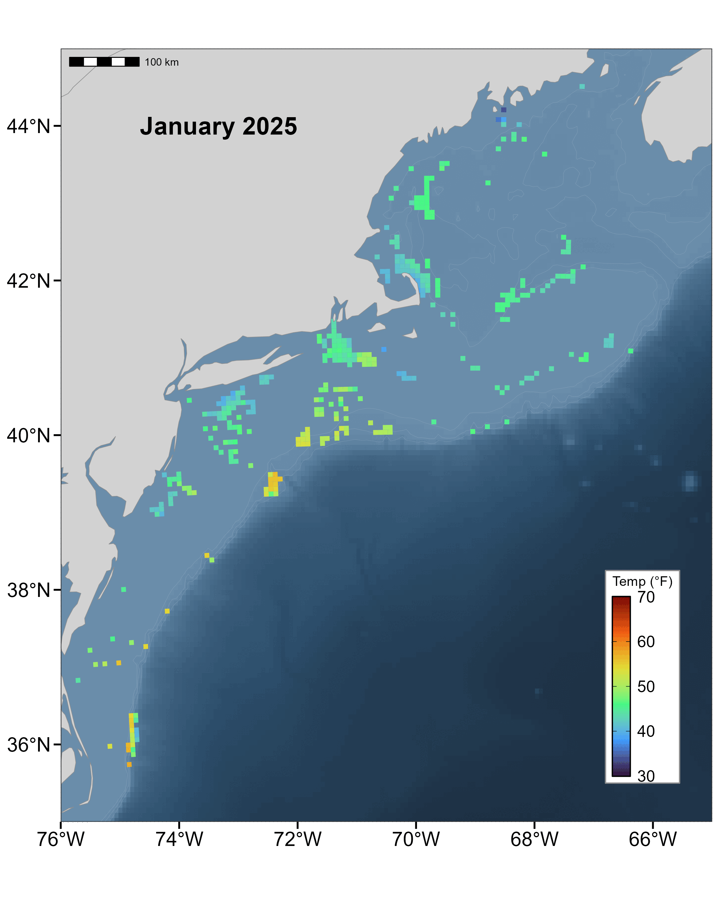
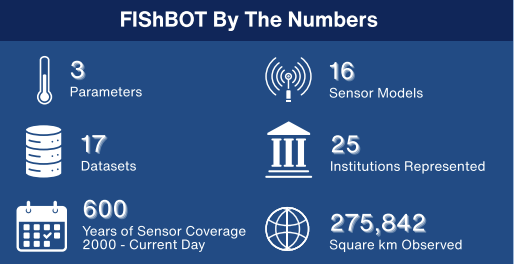
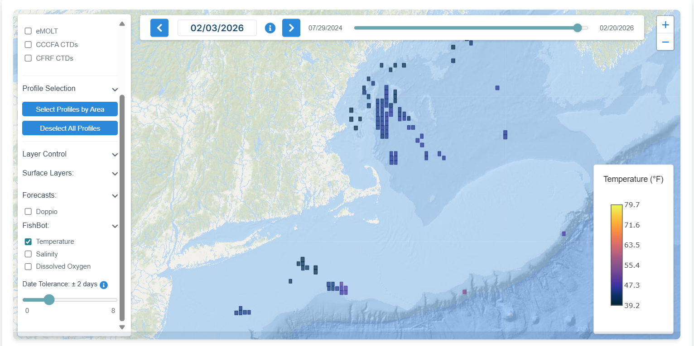

 
 
 
 

:::: {.columns}
::: {.column width="55%"}
### A Cooperative Ocean Observing Product
 

#### **FIShBOT** is a new data product built to increase access to observations of underwater conditions collected by both fishing and science communities. 

#### This standardized in-situ gridded dataset demonstrates the power of collaboration by integrating diverse oceanographic datasets in effort to transform raw information into impactful, real-world tools.

 

#### **Temporal Range:** 2000-01-01 - Present Day

#### **Spatial Domain:** Western Gulf of Maine to Cape Hatteras 

:::

::: {.column width="5%"}
<!-- Empty column for spacing -->
:::

::: {.column width="40%"}
{width='100%'}
:::

::::

:::: {.columns}
::: {.column width="40%"}
 

:::

::: {.column width="5%"}
<!-- Empty column for spacing -->
:::

::: {.column width="55%"}

## What data does FIShBOT provide? 
#### Researchers and the fishing community alike share the need to better understand and monitor ocean conditions in our dynamic region. FIShBOT data comes directly from sensors that measure: 

::: {.custom-list}
- <b>Temperature</b>
- <b>Salinity</b>
- <b>Dissolved Oxygen</b>
:::

:::

::::

 

:::: {.columns}

::: {.column width="55%"}

 

# Where can you find FIShBOT?
#### You can find us lots of places! 

::: {.custom-list}
- <b>[Our ERDDAP Data Server](https://erddap.ondeckdata.com/erddap/tabledap/fishbot_realtime.graph):</b>
Users can generate maps for any area on any given day. You can also download 
the data here!
- <b>[Cape Cod Ocean Watch Data Portal](https://ccocean.whoi.edu/):</b> FIShBOT is 
   a layer you can add on to the map for any given date!
:::
:::

::: {.column width="5%"}
<!-- Empty column for spacing -->
:::

::: {.column width="40%"}
 
 

#### Cape Cod Ocean Watch Data Poral
{width='100%}
:::

::::

