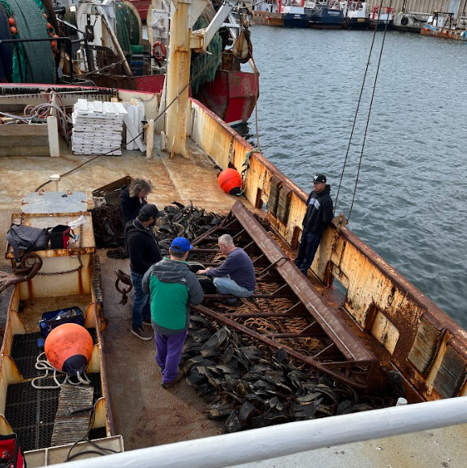

<!--First Row with 'hero' style -->
::: {.hero-chunk}

::: {.container}

::: {.row .align-items-center}

<!-- LEFT COLUMN: Text and Metadata -->
::: {.col-md-6 .text-start}

A Cooperative Ocean Observing Product

Transforming raw information into impactful, real-world tools.

**FIShBOT** was built to increase access to observations of underwater conditions collected by both fishing and science communities.
All bottom data are standardized into a gridded dataset and updated every 24 hours.

::: {.info-box}
<i class="bi bi-calendar-range"></i> **Temporal Range:** 2000-01-01 – Present  

<i class="bi bi-geo-alt-fill"></i> **Spatial Domain:** Western Gulf of Maine to Cape Hatteras

:::

:::

<!-- RIGHT COLUMN: The GIF -->
::: {.col-md-6}
::: {.map-frame}

FiShBOT Bottom Temperature (February 2025)

:::
:::

:::
:::
:::

<!-- Middle Row with the new chunk style -->
::: {.section-chunk}
:::: {.columns}
::: {.column width="40%"}
 

(L-R) Farrell Davis and Samir Patel (Coonamessett Farm Foundation), Huanxin Xu (Gulf of Maine Lobster Foundation), Captain Peter Barcz and Rio Ypon (F/V Atlantic) discuss placement of a sensor on a scallop dredge in New Bedford, MA. Photo credit: NOAA Fisheries

:::

::: {.column width="5%"} 
<!-- Empty column for spacing -->
:::

::: {.column width="55%"}
 
 

## What data does FIShBOT provide? 
#### Researchers and the fishing community alike share the need to better understand and monitor ocean conditions in our dynamic region. FIShBOT data comes directly from sensors that measure: 

 

{height=1.5em}&nbsp;<b>Temperature</b>

{height=1.5em}&nbsp;<b>Salinity</b>

{height=1.5em}&nbsp;<b>Dissolved Oxygen</b>

:::
::::
:::

<!-- Third Row with tiles -->
::: {.step style="background-color: #E8F6F3;"}
::: {.container}
::: {.row .align-items-center}

<!-- Left Side: Text Content -->
::: {.col-md-6}
# Where can you find **FIShBOT**?
#### You can find us in lots of places!

::: {.data-link-card}
### [[Our ERDDAP Data Server](https://erddap.ondeckdata.com/erddap/tabledap/fishbot_realtime.graph){target="_blank"}]{.link-title}

Users can generate maps for any area on any given day. You can also download the data here!
:::

::: {.data-link-card}
### [[Cape Cod Ocean Watch Data Portal](https://ccocean.whoi.edu/){target="_blank"}]{.link-title}
FishBOT is a layer you can add on to the map for any given date!
:::
:::

<!-- Right Side: Image/Portal Preview -->
::: {.col-md-6}
::: {.image-frame}
 
{fig-alt="Cape Cod Ocean Watch Portal"}

Cape Cod Ocean Watch Data Portal: An interactive tool by Woods Hole Oceanographic Institution

:::
:::

:::
:::
:::

